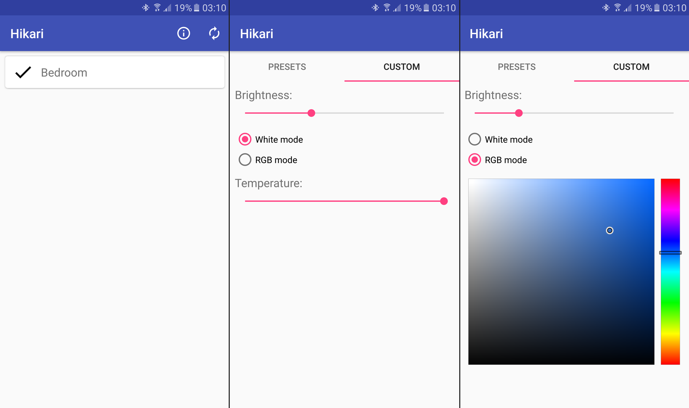

# Hikari

This is an unofficial Android application for Mixberry Lightmania lamps.

## Status

Still in development, but already better than the stock app. :wink:

## Features supported

- Discovering LightMania lamps;
- Turning lamps on/off;
- Tuning brightness;
- Tuning temperature for white mode, color for RGB mode.

## Screenshots

## Download

You can download the latest binary in the [releases](https://github.com/yanex/hikari/releases) page.